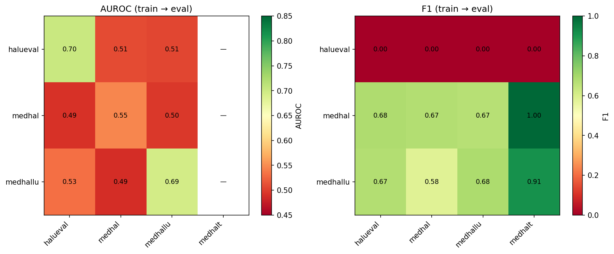
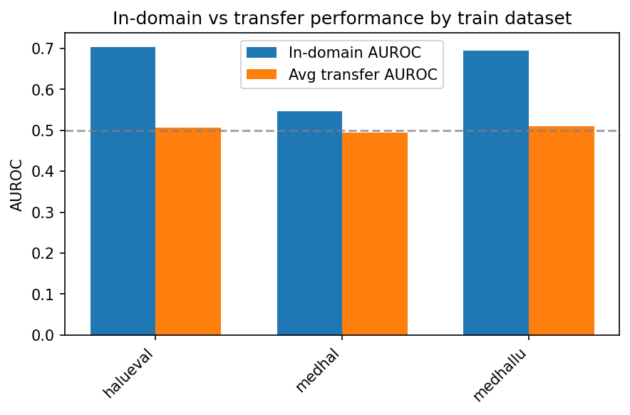

# Hallucination Detection Project

Cross-dataset hallucination detector for LLM outputs using geometric methods on hidden states. The detector is trained (probed) on one dataset and evaluated on others to measure cross-domain transferability.

## Repository layout

- **word2vec-numpy/** — Skip-gram word2vec in pure NumPy (Task #1; no ML frameworks except sklearn for evaluation).
- **hallucination-detector/** — Full geometric hallucination detection pipeline (datasets, extractor, probe, transfer evaluation).

All implementation lives under this repo; code from `jetbrains-rl` and `jetbrains-reason-slm` was used as reference where applicable.

## Quick start

### Word2Vec (NumPy)

```bash
cd word2vec-numpy
pip install -r requirements.txt
python data/fetch_text8.py
python run_train.py
python -m src.evaluate --W_in checkpoints/W_in_epoch5.npy --vocab checkpoints/vocab_word2idx.npy
```

### Hallucination detector

```bash
cd hallucination-detector
pip install -r requirements.txt
python scripts/01_download_datasets.py
python scripts/02_preprocess.py
# GPU (Colab): extract features, then train and evaluate (see hallucination-detector/README.md)
```

## Hardware

- **H100 (80GB)** — Recommended for full pipeline (Llama 8B, 4-bit).
- **A100 / L4** — Suitable for extraction and training.
- **T4 (16GB)** — Use small model (e.g. `facebook/opt-125m`) and 4-bit if needed.
- Runs on **CUDA/GPU** (e.g. Google Colab).

## Evaluation results (hallucination detector)

Transfer matrix: train a probe on one dataset, evaluate on all (HaluEval, MedHallu, Med-HALT, MedHal). Med-HALT has only one class so it is skipped as train set; AUROC is undefined when evaluating on it.

### Baseline: opt-125m (2k samples per dataset)

| Plot | Description |
|------|-------------|
| Transfer matrix (AUROC and F1) | Train → eval heatmaps |
| In-domain vs transfer | Bar chart by training dataset |





### LLM comparison (opt-125m vs Llama 3.1 8B)

The [evaluation notebook](hallucination-detector/evaluation.ipynb) produces two result sets:

| Model | Output CSV | Notes |
|-------|------------|--------|
| **facebook/opt-125m** | `results/transfer_matrix_seeded.csv` | Lightweight baseline; fast on CPU/small GPU. |
| **meta-llama/Llama-3.1-8B** (4-bit) | `results/transfer_matrix_seeded_llama8b.csv` | Optional second run in the notebook; requires GPU and HF token with Llama access. |

The same plots (heatmaps, in-domain vs transfer) can be generated for each:

```bash
cd hallucination-detector
# Baseline (opt-125m)
python scripts/plot_transfer_results.py --csv results/transfer_matrix_seeded.csv
# Llama 8B (after running the Llama section in the notebook)
python scripts/plot_transfer_results.py --csv results/transfer_matrix_seeded_llama8b.csv --results-dir results
```

Comparing the two: Llama 8B typically gives stronger in-domain and transfer AUROC than opt-125m; the geometric probe benefits from better hidden-state structure in the larger model.

---

**Main evaluation notebook:** [hallucination-detector/evaluation.ipynb](hallucination-detector/evaluation.ipynb) — full reproducible evaluation (datasets, features, transfer matrix with 3 seeds, ablations). Run on Colab with GPU; set `PROJECT_DIR` and HuggingFace token.

**Regenerate plots:** `cd hallucination-detector && python scripts/plot_transfer_results.py` (uses `results/transfer_matrix_seeded.csv` by default).

---

## Task summary

1. **Word2Vec**: Implement SGNS in NumPy (forward, loss, gradients, SGD); evaluate with Google word analogies; document gradient derivation and design choices.
2. **Hallucination detector**: Implement geometric probe (Mahalanobis, cosine, norm, layer diff), train on one dataset, evaluate transfer to others; produce transfer matrix (AUROC) and ablations.
